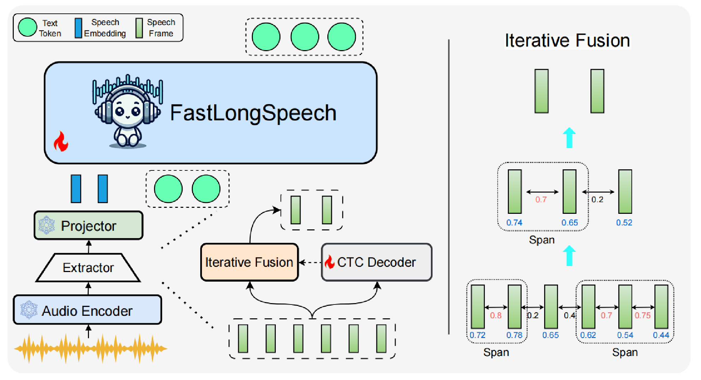

# FastLongSpeech: Enhancing Large Speech-Language Models for Efficient Long-Speech Processing

[](https://arxiv.org/abs/2507.14815)
[](https://huggingface.co/ICTNLP/FastLongSpeech)
[](https://huggingface.co/datasets/ICTNLP/LongSpeech-Eval)

> **[Shoutao Guo](https://scholar.google.com/citations?user=XwHtPyAAAAAJ&hl=zh-CN), [Shaolei Zhang](https://zhangshaolei1998.github.io/), [Qingkai Fang](https://fangqingkai.github.io/), [Zhengrui Ma](https://scholar.google.com/citations?user=dUgq6tEAAAAJ&hl=en), [Min Zhang](https://scholar.google.com/citations?user=CncXH-YAAAAJ&hl=en),  [Yang Feng*](https://people.ucas.edu.cn/~yangfeng?language=en)**

FastLongSpeech is a novel framework designed to extend the capabilities of Large Speech-Language Models for efficient long-speech processing without necessitating dedicated long-speech training data. The [model](https://huggingface.co/ICTNLP/FastLongSpeech) and proposed evaluation [dataset](https://huggingface.co/datasets/ICTNLP/LongSpeech-Eval) is available now! 

<p align="center" width="80%">

</p>

> [!Note]
> FastLongSpeech will extend the long-speech processing capabilities of Large Speech-Language Models with only short-duration training data, which improves the efficiency of multiple audio tasks, including:
> - **Computational effort**: 57% FLOPs reduction with better performance
> - **Response latency**: From **4.80s** to **1.47s** on NVIDIA L40 GPU
<p align="center" width="80%">

</p>

## 🔥 Quick Start
### Requirements
Download Qwen2-Audio Models
- Install packages:
  ```
  git clone https://github.com/ictnlp/FastLongSpeech.git
  cd transformers-main
  pip install -e .
  pip install deepspeed sentencepiece librosa 
  ```

### Two-stage Training

#### First-Stage CTC training

-  You can use the [scripts/run_asr.sh](https://github.com/ictnlp/FastLongSpeech/blob/main/scripts/run_asr.sh) to conduct the first-stage training based on the vanilla model:

```
#!/bin/bash

export PYTHONPATH=the_path_of_the_program
EXP=exp_dir
TRAIN_DIR=train_dir
BASE_MODEL=base_model
TRAIN_CONFIG=train_path
VALID_CONFIG=valid_path


deepspeed --include localhost:0,1,2,3,4,5,6,7 --master_port 29602 FastLongSpeech/training_file/train_ctc.py \
    --lora_enable False --lora_r 128 --lora_alpha 256 --ctc_decoder_lr 2e-5 \
    --deepspeed FastLongSpeech/configuration/zero3.json \
    --model_name_or_path $BASE_MODEL \
    --data_path $TRAIN_CONFIG \
    --validate_path $VALID_CONFIG \
    --ctc_decoder 'projector_llm_embed' \
    --ctc_training False \
    --ctc_embed_num 10000 \
    --freeze_backbone True \
    --freeze_speechLLMs True \
    --group_by_modality_length True \
    --fp16 True \
    --output_dir FastLongSpeech/checkpoints/$EXP \
    --num_train_epochs 1 \
    --per_device_train_batch_size 16 \
    --per_device_eval_batch_size 1 \
    --gradient_accumulation_steps 1 \
    --evaluation_strategy "steps" \
    --eval_steps 1000 \
    --save_strategy "steps" \
    --save_steps 2000 \
    --save_total_limit 2 \
    --learning_rate 2e-4 \
    --weight_decay 0. \
    --warmup_ratio 0.03 \
    --lr_scheduler_type "cosine" \
    --metric_for_best_model 'loss' \
    --load_best_model_at_end True \
    --greater_is_better False \
    --do_eval True \
    --logging_steps 20 \
    --tf32 True \
    --gradient_checkpointing True \
    --dataloader_num_workers 4 \
    --report_to tensorboard 2>&1 | tee FastLongSpeech/logs/$EXP.txt
```

#### Second-Stage Dynamic Sampling Training

-  You can use the [scripts/run_dynamic_training.sh](https://github.com/ictnlp/FastLongSpeech/blob/main/scripts/run_dynamic_training.sh) to conduct the second-stage training based on the model undergoing the first-stage training:

```
#!/bin/bash

export PYTHONPATH=the_path_of_the_program
EXP=exp_dir
TRAIN_DIR=train_dir
BASE_MODEL=base_model
TRAIN_CONFIG=train_path
VALID_CONFIG=valid_path


deepspeed --include localhost:0,1,2,3,4,5,6,7 --master_port 29602 FastLongSpeech/training_file/train_llms.py \
    --lora_enable True --lora_r 128 --lora_alpha 256 --ctc_decoder_lr 2e-5 \
    --deepspeed FastLongSpeech/configuration/zero2.json \
    --model_name_or_path $BASE_MODEL \
    --data_path $TRAIN_CONFIG \
    --validate_path $VALID_CONFIG \
    --ctc_decoder 'projector_llm_embed' \
    --ctc_training False \
    --ctc_embed_num 10000 \
    --freeze_backbone False \
    --freeze_speechLLMs True \
    --group_by_modality_length True \
    --fp16 True \
    --output_dir FastLongSpeech/checkpoints/$EXP \
    --num_train_epochs 2 \
    --per_device_train_batch_size 4 \
    --per_device_eval_batch_size 4 \
    --gradient_accumulation_steps 4 \
    --evaluation_strategy "steps" \
    --eval_steps 2000 \
    --save_strategy "steps" \
    --save_steps 2000 \
    --save_total_limit 2 \
    --learning_rate 2e-4 \
    --weight_decay 0. \
    --warmup_ratio 0.03 \
    --lr_scheduler_type "cosine" \
    --metric_for_best_model 'loss' \
    --greater_is_better False \
    --do_eval True \
    --logging_steps 20 \
    --tf32 True \
    --gradient_checkpointing True \
    --dataloader_num_workers 4 \
    --report_to tensorboard 2>&1 | tee FastLongSpeech/logs/$EXP.txt
```

### Inference

- Run the CTC ASR inference using [scripts/infer_asr.sh](https://github.com/ictnlp/FastLongSpeech/blob/main/scripts/infer_asr.sh).
- Run the short-duration speech inference using [scripts/infer_chat_lora.sh](https://github.com/ictnlp/FastLongSpeech/blob/main/scripts/infer_chat_lora.sh).
- Run the long-duration speech inference using [scripts/infer_chat_longspeech.sh](https://github.com/ictnlp/FastLongSpeech/blob/main/scripts/infer_chat_longspeech.sh).

## 🤝 Acknowledgement
- [LLaVA](https://github.com/haotian-liu/LLaVA): LLaVA-Mini is built upon LLaVA codebase, a large language and vision assistant.
- [Llama-Omni](https://github.com/ictnlp/LLaMA-Omni): Llama-Omni is a end-to-end speech LLMs.

## 🖋Citation

If this repository is useful for you, please cite as:

```
@misc{guo2025fastlongspeechenhancinglargespeechlanguage,
      title={FastLongSpeech: Enhancing Large Speech-Language Models for Efficient Long-Speech Processing}, 
      author={Shoutao Guo and Shaolei Zhang and Qingkai Fang and Zhengrui Ma and Min Zhang and Yang Feng},
      year={2025},
      eprint={2507.14815},
      archivePrefix={arXiv},
      primaryClass={cs.CL},
      url={https://arxiv.org/abs/2507.14815}, 
}
```

If you have any questions, please feel free to submit an issue or contact `guoshoutao22z@ict.ac.cn`.
